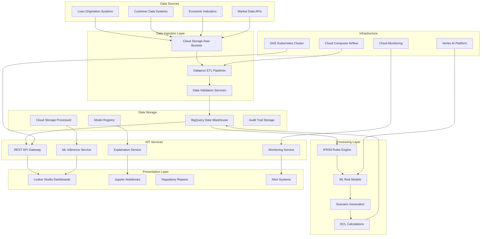
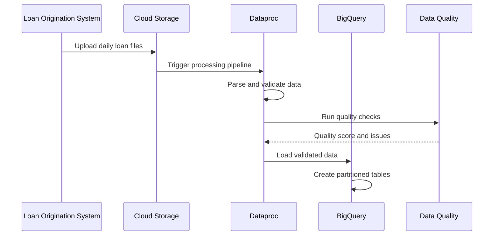
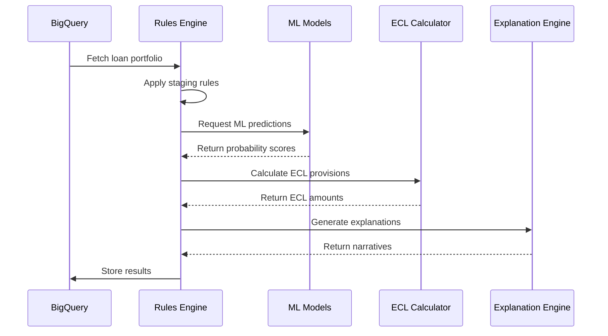

# IFRS9 Risk System - Technical Architecture

## Overview

The IFRS9 Risk System is a comprehensive, enterprise-grade credit risk management platform designed to ensure regulatory compliance with IFRS9 accounting standards. The system processes large-scale loan portfolios, performs sophisticated risk calculations, and provides real-time monitoring and reporting capabilities.

## System Architecture

### High-Level Architecture



## Component Architecture

### 1. Data Ingestion Layer

**Purpose**: Secure, scalable ingestion of raw financial data from multiple sources.

**Components**:
- **Cloud Storage Raw Buckets**: Immutable storage for raw data with lifecycle policies
- **Dataproc ETL Pipelines**: PySpark-based processing for data transformation
- **Data Validation Services**: Schema validation and data quality checks

**Key Features**:
- Multi-format support (CSV, JSON, Parquet, Avro)
- Automatic schema evolution and validation
- Data lineage tracking and audit trails
- Error handling and dead letter queues

### 2. Processing Layer

**Purpose**: Core business logic for IFRS9 compliance and risk calculations.

**Components**:

#### IFRS9 Rules Engine (`src/ifrs9_engine.py`)
- Staging classification logic (Stage 1, 2, 3)
- Significant Increase in Credit Risk (SICR) detection
- Credit-impaired asset identification
- Regulatory compliance validation

#### Machine Learning Models (`src/enhanced_ml_models.py`)
- **XGBoost**: Primary classifier for staging decisions
- **LightGBM**: High-performance alternative for large datasets
- **CatBoost**: Categorical feature specialist
- **Ensemble Methods**: Model averaging and stacking

#### AI Explanation Engine (`src/ai_explanations.py`)
- **SHAP Integration**: Feature importance and contribution analysis
- **Vertex AI Explanations**: Google Cloud native explainability
- **Gemini AI**: Natural language explanations for business users
- **Regulatory Narratives**: Automated compliance documentation

### 3. Data Storage Layer

**Purpose**: Scalable, secure, and compliant data persistence.

**Components**:

#### BigQuery Data Warehouse
- **Raw Dataset**: Immutable source data with partitioning
- **Processed Dataset**: Validated and enriched data
- **Analytics Dataset**: Aggregated views for reporting
- **ML Dataset**: Feature engineering and training data

#### Cloud Storage Tiers
- **Hot Storage**: Frequently accessed current data
- **Nearline Storage**: Monthly reporting and analysis data
- **Coldline Storage**: Historical data and compliance archives
- **Archive Storage**: Long-term regulatory retention

### 4. API Services Layer

**Purpose**: Secure, scalable REST APIs for system integration.

**Components**:

#### REST API Gateway (`docker/production/Dockerfile.api`)
- **FastAPI Framework**: High-performance async API
- **Authentication**: OAuth 2.0 and JWT token validation
- **Rate Limiting**: Request throttling and quota management
- **Documentation**: Auto-generated OpenAPI specifications

#### Endpoints:
```
POST /api/v1/calculate/staging    - IFRS9 staging calculations
POST /api/v1/calculate/ecl        - Expected Credit Loss calculations
POST /api/v1/predict/risk         - ML-based risk predictions
POST /api/v1/explain/decision     - AI-powered explanations
GET  /api/v1/health               - Health check endpoint
GET  /api/v1/metrics              - Prometheus metrics
```

### 5. Infrastructure Layer

**Purpose**: Cloud-native, scalable, and secure infrastructure.

**Components**:

#### Google Kubernetes Engine (GKE)
- **Node Pools**: Auto-scaling worker nodes with GPU support
- **Service Mesh**: Istio for traffic management and security
- **Ingress Controllers**: NGINX for external access
- **Pod Security Policies**: Container security enforcement

#### Cloud Composer (Apache Airflow)
- **DAG Orchestration**: Workflow automation and scheduling
- **Dependency Management**: Complex pipeline coordination
- **Error Handling**: Retry logic and failure notifications
- **Resource Scaling**: Dynamic resource allocation

## Data Flow Architecture

### 1. Data Ingestion Flow



### 2. IFRS9 Processing Flow



## Security Architecture

### 1. Identity and Access Management (IAM)

**Principle**: Zero-trust security model with least privilege access.

**Components**:
- **Service Accounts**: Dedicated accounts for each service
- **Workload Identity**: Secure GKE-to-GCP authentication
- **Role-Based Access Control (RBAC)**: Granular permission management
- **Multi-Factor Authentication (MFA)**: Required for all human access

### 2. Data Encryption

**At Rest**:
- Cloud KMS encryption for all storage
- Customer-managed encryption keys (CMEK)
- Transparent database encryption

**In Transit**:
- TLS 1.3 for all communications
- mTLS for service-to-service communication
- VPN connectivity for external integrations

### 3. Network Security

**Components**:
- **Private GKE Clusters**: No public IP addresses
- **VPC Peering**: Secure inter-service communication
- **Firewall Rules**: Restrictive ingress/egress policies
- **Network Policies**: Pod-to-pod communication control

## Scalability Architecture

### 1. Horizontal Scaling

**Auto-scaling Triggers**:
- CPU utilization > 70%
- Memory utilization > 80%
- Queue depth > 100 messages
- Response time > 2 seconds

**Scaling Targets**:
- **API Services**: 2-10 replicas
- **Processing Jobs**: 1-20 Dataproc workers
- **Storage**: Automatic BigQuery slots allocation

### 2. Performance Optimization

**BigQuery Optimization**:
- Partitioning by date and region
- Clustering by risk attributes
- Materialized views for frequent queries
- Query result caching

**ML Model Optimization**:
- Model versioning and A/B testing
- Feature store for consistent features
- Batch prediction for efficiency
- Online prediction caching

## Monitoring and Observability

### 1. Metrics Collection

**Infrastructure Metrics**:
- CPU, memory, disk, network utilization
- Container resource consumption
- Kubernetes cluster health
- Storage usage and performance

**Business Metrics**:
- Loan processing throughput
- Model prediction accuracy
- IFRS9 compliance rates
- Data quality scores

### 2. Alerting Strategy

**Critical Alerts** (5-minute SLA):
- System downtime or service failures
- Data pipeline failures
- Security breaches or unauthorized access
- Regulatory compliance violations

**Warning Alerts** (1-hour SLA):
- Performance degradation
- High error rates
- Data quality issues
- Resource utilization thresholds

## Disaster Recovery

### 1. Backup Strategy

**Data Backups**:
- **Daily**: Incremental BigQuery table snapshots
- **Weekly**: Full database backups to separate region
- **Monthly**: Long-term archive to Coldline storage
- **Real-time**: Transaction log shipping for critical data

**Configuration Backups**:
- **Continuous**: Git-based infrastructure as code
- **Daily**: Kubernetes configuration snapshots
- **On-change**: Application configuration backups

### 2. Recovery Procedures

**Recovery Time Objectives (RTO)**:
- **Tier 1 Services**: 15 minutes (API, monitoring)
- **Tier 2 Services**: 1 hour (batch processing)
- **Tier 3 Services**: 4 hours (reporting, analytics)

**Recovery Point Objectives (RPO)**:
- **Critical Data**: 5 minutes maximum data loss
- **Business Data**: 1 hour maximum data loss
- **Analytics Data**: 24 hours maximum data loss

## Integration Architecture

### 1. External System Integration

**Supported Protocols**:
- REST APIs with JSON payloads
- SFTP for secure file transfers
- Message queues (Cloud Pub/Sub)
- Database direct connections

**Data Formats**:
- JSON for API communications
- CSV for bulk data transfers
- Parquet for analytics workflows
- Avro for schema evolution

### 2. Event-Driven Architecture

**Event Sources**:
- Data ingestion completion
- Model training completion
- Alert threshold breaches
- Regulatory deadline reminders

**Event Consumers**:
- Notification services
- Downstream processing systems
- Audit logging systems
- Dashboard refresh triggers

## Technology Stack

### 1. Core Technologies

| Layer | Technology | Purpose |
|-------|-----------|---------|
| Frontend | Looker Studio, Jupyter | Dashboards and analysis |
| API | FastAPI, Python 3.11 | REST API services |
| Processing | PySpark, Pandas | Data processing |
| ML/AI | XGBoost, TensorFlow, Vertex AI | Machine learning |
| Storage | BigQuery, Cloud Storage | Data persistence |
| Orchestration | Cloud Composer, Airflow | Workflow management |
| Container | Docker, Kubernetes | Application deployment |
| Monitoring | Prometheus, Grafana | System observability |

### 2. Development Tools

| Category | Tool | Purpose |
|----------|------|---------|
| Version Control | Git, GitHub | Source code management |
| CI/CD | GitHub Actions | Automated deployment |
| Testing | pytest, coverage | Quality assurance |
| Security | Bandit, Safety | Vulnerability scanning |
| Documentation | MkDocs, Sphinx | Technical documentation |
| Infrastructure | Terraform | Infrastructure as code |

## Compliance and Regulatory

### 1. IFRS9 Compliance

**Requirements**:
- **Stage Classification**: Automated SICR detection
- **ECL Calculation**: Forward-looking loss provisioning
- **Model Governance**: Version control and audit trails
- **Documentation**: Regulatory reporting automation

### 2. Data Governance

**Policies**:
- **Data Retention**: 7-year regulatory compliance period
- **Data Privacy**: GDPR-compliant personal data handling
- **Data Quality**: Automated validation and monitoring
- **Data Lineage**: End-to-end traceability

### 3. Audit Trail

**Components**:
- **User Actions**: All system interactions logged
- **Data Changes**: Complete change history maintained
- **Model Decisions**: Explanation and rationale stored
- **System Events**: Infrastructure and application events

This architecture enables the IFRS9 Risk System to meet regulatory requirements while providing scalable, secure, and maintainable enterprise-grade functionality.